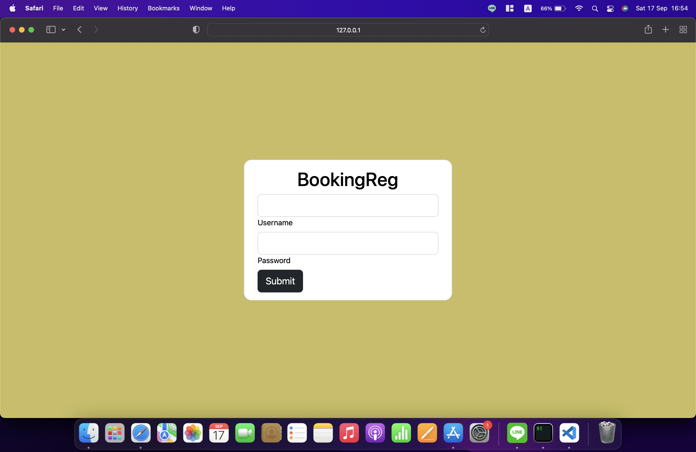
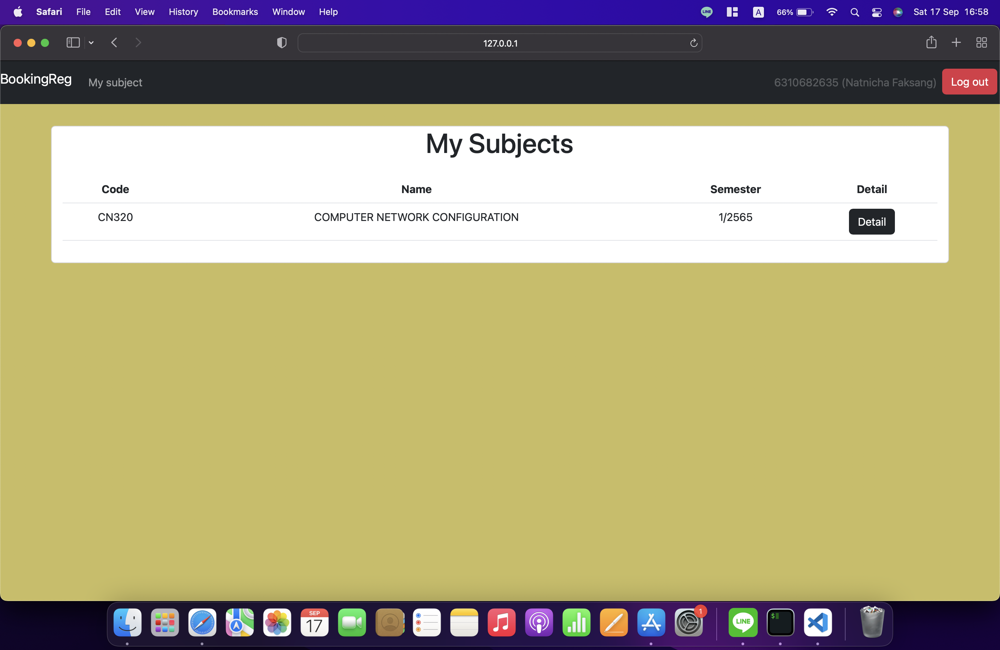

<!-- ABOUT THE PROJECT -->
## About The Project

[![Product Name Screen Shot][product-screenshot]][github-url]

BookingReg is a Web Application of Registration for admin and user.

### Built With

* [![Django][djangoproject.com]][Django-url]
* [![Bootstrap][Bootstrap.com]][Bootstrap-url]

<!-- GETTING STARTED -->
## Getting Started

In this website, students can check the details of the courses they are registed in, regist courses and cancel the regist request.

### Prerequisites

You have to install software before using the project.

1. Download [Python](https://www.python.org/downloads/)
2. Install [Visual Studio Code](https://code.visualstudio.com/download)

### Installation

1. Clone the repo
    ```sh
    git clone https://github.com/asnnat/cn331-as2.git cn331-as2
    ```
2. Change directory to the project
    ```sh
    cd cn331-as2
    ```
2. Open the dirctory with Visual Studio Code
    ```sh
    code .
    ```
5. Install requirements for the project
    ```sh
    python -m pip install -r requirements.txt
    ```

<!-- USAGE -->
## Usage

1. Open git bash terminal in Visual Studio Code
2. Activate virtual environment
    ```sh
    source ./.venv/Scripts/activate
    ```
3. Change directory to project directory
    ```sh
    cd registration
    ```
4. Run server
    ```sh
    python manage.py runserver
    ```
5. If you are user, log in via [http://127.0.0.1:8000](http://127.0.0.1:8000/)
6. If you are admin, log in via [http://127.0.0.1:8000/admin](http://127.0.0.1:8000/admin)

### LogIn Page 

[](http://127.0.0.1:8000/)

Students can login with `Username is student ID` and `Password is cn331pass`.

Once you have successfully logged in, the system will display the [Regist](#regist-page) page.
 
### Regist Page

[](images/user_subject.png)

Click ***Detail*** button to see detail of the subject.

[](images/user_registsubject.png)

Click ***Regist*** button to regist the subject.

Once you have successfully registered, the system will take you to [My Subject](#my-subject-page) page.

### My Subject Page

[](images/user_mysubject.png)

Click ***Detail*** button to see detail of the subject that you registed.

[](images/user_removesubject.png)

Click ***Remove*** button to unregist the subject.

### Logout

Click ***Logout*** button at top right corner to logout.

[](images/user_logout.png)

Whenever you successfully logout, you will be returned to the login page with message ***You are logged out.***

<!-- CONTACT -->
## Contact

* Natnicha Faksang - 6310682635 - 6310682635@student.tu.ac.th
* Kantapat Kowadisai - 6310682783 - 6310682783@student.tu.ac.th

<!-- MARKDOWN LINKS & IMAGES -->
[product-screenshot]: images/user_login.png
[github-url]: https://github.com/asnnat/cn331-as2
[djangoproject.com]: https://img.shields.io/badge/Djang0-35495E?style=for-the-badge&logo=django&logoColor=4FC08D
[Django-url]: https://www.djangoproject.com/
[Bootstrap.com]: https://img.shields.io/badge/Bootstrap-563D7C?style=for-the-badge&logo=bootstrap&logoColor=white
[Bootstrap-url]: https://getbootstrap.com